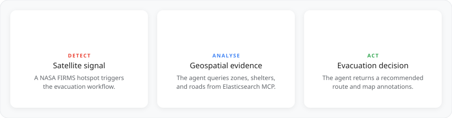
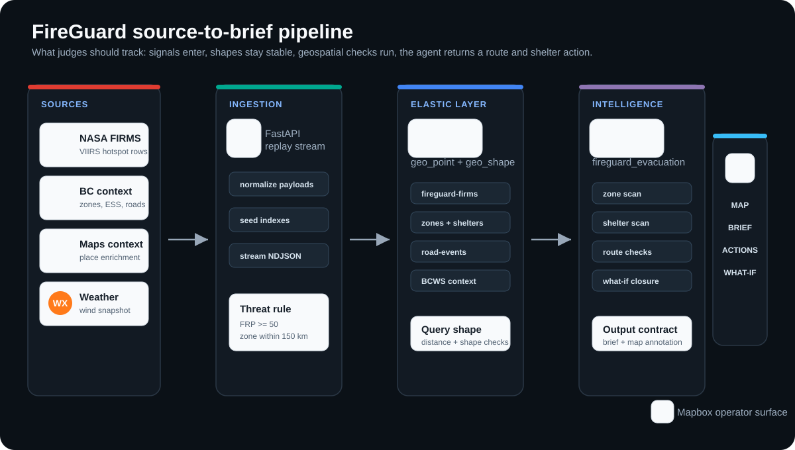
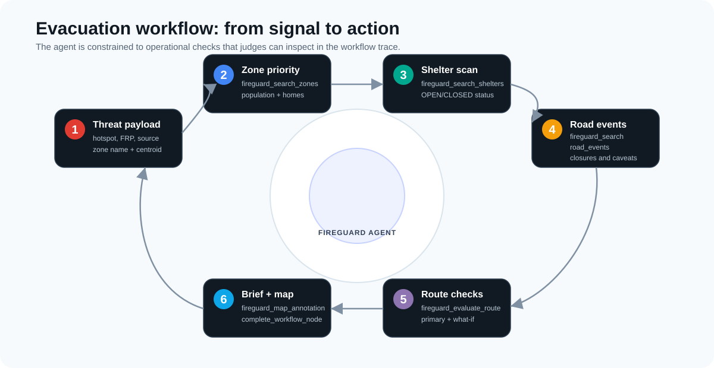
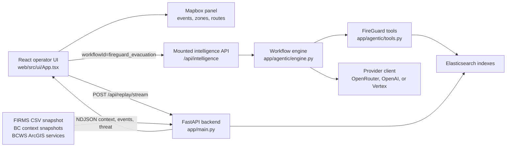
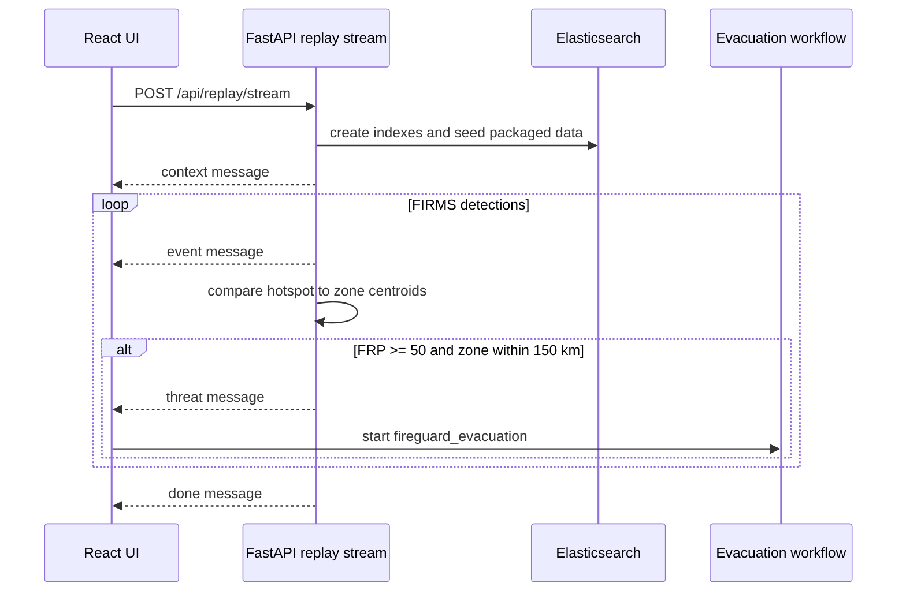
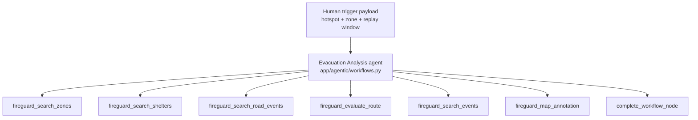

# FireGuard Whitepaper

<div align="center">

**Satellite-triggered wildfire evacuation coordination for the Google Cloud Rapid Agent Hackathon**

<p>
  
  &nbsp;&nbsp;
  
  &nbsp;&nbsp;
  
  &nbsp;&nbsp;
  
  &nbsp;&nbsp;
  
  &nbsp;&nbsp;
  
  &nbsp;&nbsp;
  
</p>


</div>

---

## Table of Contents

- [Judge Read](#judge-read)
- [Visual Overview](#visual-overview)
- [What FireGuard Does](#what-fireguard-does)
- [Scenario](#scenario)
- [Quick Start](#quick-start)
- [System Design](#system-design)
  - [Runtime Architecture](#runtime-architecture)
  - [Replay and Trigger Loop](#replay-and-trigger-loop)
  - [Evacuation Workflow](#evacuation-workflow)
  - [Indexed Data](#indexed-data)
- [Design Notes](#design-notes)
  - [Stable Event Contracts](#stable-event-contracts)
  - [Agent Tooling](#agent-tooling)
  - [Map Annotations](#map-annotations)
  - [Route What-Ifs](#route-what-ifs)
- [Tech Stack](#tech-stack)
- [Project Structure](#project-structure)
- [Verification](#verification)

---

## Judge Read

FireGuard is built around one operational question:

> A satellite detects a high-intensity wildfire hotspot near a populated evacuation zone. What should the incident commander do next?

The app answers that question by connecting detection, indexed geospatial evidence, an evacuation workflow, and an operator-facing map.

| Judge question | FireGuard answer | Where to inspect |
|---|---|---|
| What starts the workflow? | A streamed FIRMS hotspot with `frp >= 50` within 150 km of a seeded zone centroid. | `app/main.py` |
| What evidence does the agent use? | Elasticsearch indexes for FIRMS detections, zones, shelters, road events, BCWS incidents, and BCWS perimeters. | `app/main.py`, `app/agentic/tools.py` |
| What does the agent decide? | Affected zone, shelter status, route safety, road constraints, and a recommended evacuation action. | `app/agentic/workflows.py` |
| How does the operator see it? | React opens the intelligence panel, then map annotations show hotspot, zone, shelters, blockages, and routes. | `web/src/ui/App.tsx`, `web/src/intelligence/App.tsx` |
| How is the Google track represented? | Google ADK powers the Vertex Gemini client path, with provider selection controlled by configuration. | `app/agentic/vertex.py`, `app/agentic/config.py` |
| How is the Elastic track represented? | The data layer uses Elasticsearch geospatial mappings, multi-index search, and route checks against indexed constraints. | `app/main.py`, `app/agentic/tools.py` |

---

## Visual Overview

<div align="center">
  
</div>

<div align="center">
  
</div>

<div align="center">
  
</div>

---

## What FireGuard Does

FireGuard is an AI-assisted wildfire evacuation coordination app. It combines NASA FIRMS satellite detections, BC Wildfire Service context, evacuation zones, ESS facilities, road events, weather context, Elasticsearch geospatial queries, and a FireGuard agent workflow into one operator interface.

The workflow checks:

- affected evacuation zones
- nearby ESS shelter status
- active road events
- route safety from the zone centroid to open shelters
- nearby fire detections for intensity context
- map annotations for hotspots, zone centroids, shelters, blockages, and evaluated routes

The result is an evacuation brief plus visual map context. The app is not just a point layer on a map; it is a trigger-to-action workflow.

---

## Scenario

The default UI replay window centers on the Williams Lake / Cariboo region from July 17-25, 2024. The bundled 45-row FIRMS CSV is a local seed snapshot; when `NASA_FIRMS_MAP_KEY` is configured, the backend collects the requested FIRMS chunks before replaying indexed events.

The React UI streams FIRMS detections from the FastAPI backend. When a hotspot passes the threshold and is close enough to a seeded evacuation zone centroid, the backend emits a `threat` event. The UI opens the FireGuard evacuation workflow with the hotspot, affected zone, replay window, and session context.

The judge-facing path is:

1. Start the replay from the web UI.
2. Watch FIRMS detections stream onto the map and event feed.
3. When the threat arrives, inspect the automatic `fireguard_evacuation` workflow.
4. Check the tool trace: zones, shelters, roads, routes, fire context, map annotation, completion payload.
5. Ask a route what-if question and inspect the route reevaluation.

---

## Quick Start

```bash
python3 -m venv .venv
. .venv/bin/activate
pip install -r requirements.txt

cd web
npm install
cd ..

cp .env.example .env
./start.sh
```

`./start.sh` launches:

| Service | URL |
|---|---|
| FastAPI backend | `http://127.0.0.1:8100` |
| Vite frontend | `http://127.0.0.1:5174` |

Configure `.env` from `.env.example` for the services you plan to use: Elasticsearch, Mapbox, NASA FIRMS, and the selected intelligence provider.

---

## System Design

### Runtime Architecture



### Replay and Trigger Loop



### Evacuation Workflow



### Indexed Data

| Index suffix | Contents | Source in repo |
|---|---|---|
| `firms` | FIRMS hotspot detections and weather/place enrichment fields | `data/replay/bc_cariboo/firms_snapshot.csv` |
| `firms-cache` | FIRMS fetch cache metadata | `app/main.py` |
| `bcws-incidents` | BCWS active fire incidents | BCWS ArcGIS query path in `app/main.py` |
| `bcws-perimeters` | BCWS perimeter shapes | BCWS ArcGIS query path in `app/main.py` |
| `bcws-cache` | BCWS area cache metadata | `app/main.py` |
| `zones` | Evacuation zone centroids and polygons | `data/public/bc/historical_fire_evacuation_zones_snapshot.json` |
| `shelters` | ESS facility status and location | `data/public/bc/public_emergency_context_snapshot.json` |
| `road-events` | Road event locations and shapes | `data/replay/bc_cariboo/road_events_snapshot.json` |

Packaged data currently includes 45 FIRMS rows, 3 evacuation zones, 10 ESS facilities, 8 evacuation order or alert records, 4 policy snippets, 1 road event, and 1 weather snapshot.

---

## Design Notes

### Stable Event Contracts

Elasticsearch mappings are declared in `app/main.py` before documents are inserted. The FireGuard event payload keeps fixed shapes for fields such as `location`, `weather`, `place`, `geometry`, and route output so later inserts do not collide with prior dynamic mappings.

The threat payload is narrow by design:

```json
{
  "type": "threat",
  "hotspot": {
    "lat": 52.1,
    "lon": -121.9,
    "frp": 50.0,
    "confidence": "nominal",
    "source": "VIIRS_NOAA20_SP",
    "acquired_at": "2024-07-21T18:00:00+00:00"
  },
  "zone": {
    "name": "Williams Lake River Valley",
    "population": 1548,
    "homes": 618,
    "latitude": 52.1,
    "longitude": -122.1,
    "distance_km": 12.34
  }
}
```

### Agent Tooling

The evacuation agent gets a constrained tool surface so it can move from detection to decision without broad exploration.

| Tool | Purpose |
|---|---|
| `fireguard_stats` | Count indexed FIRMS and BCWS records |
| `fireguard_search_events` | Search FIRMS detections by location, radius, and time |
| `fireguard_search_zones` | Find evacuation zones near a point |
| `fireguard_search_shelters` | Find ESS facilities near a zone centroid |
| `fireguard_search_road_events` | Find road events near the evacuation area |
| `fireguard_evaluate_route` | Check an origin-to-destination route against indexed fire and road constraints |
| `fireguard_bcws_context` | Retrieve BCWS incident and perimeter context |
| `fireguard_map_annotation` | Push markers and routes into the UI map |
| `exa_search` | External source lookup when needed |
| `emit_message` | Stream a workflow-visible message |
| `complete_workflow_node` | Finish the workflow node with structured output |

### Map Annotations

`fireguard_map_annotation` returns a compact annotation object with `markers`, `routes`, and a short `message`. The React intelligence panel passes that object back to the map through `onAnnotation`, allowing the analysis to draw the same shelters, blockages, and recommended route that the brief describes.

### Route What-Ifs

`fireguard_evaluate_route` accepts normal route endpoints and can also evaluate operator constraints through `hypothetical_closures` or `ignore_closures`. That lets the agent answer questions such as how the evacuation action changes if a corridor closes or reopens during an incident.

---

## Tech Stack

| Layer | Technology |
|---|---|
| Backend | FastAPI, Pydantic, uvicorn |
| Agent runtime | Custom workflow engine, Google ADK Gemini client, OpenAI-compatible streaming client |
| Data store | Elasticsearch with `geo_point` and `geo_shape` mappings |
| Source data | NASA FIRMS, BCWS ArcGIS services, packaged BC public context snapshots |
| Frontend | React 18, Vite, TypeScript |
| Mapping | Mapbox GL JS |
| Intelligence UI | React Markdown, Blueprint, Monaco, XYFlow |
| Testing | pytest, TypeScript build |

---

## Project Structure

```text
fireguard/
├── app/
│   ├── main.py                 # FastAPI app, replay stream, index creation, threat trigger
│   ├── geo.py                  # Geospatial helpers
│   └── agentic/
│       ├── api.py              # Mounted intelligence API
│       ├── config.py           # Runtime configuration
│       ├── engine.py           # Workflow execution engine
│       ├── tools.py            # FireGuard, source lookup, and sandbox tools
│       ├── vertex.py           # Google ADK Gemini client
│       └── workflows.py        # fireguard_intelligence and fireguard_evacuation
├── data/
│   ├── public/bc/              # Evacuation, ESS, and policy snapshots
│   └── replay/bc_cariboo/      # FIRMS, road, and weather snapshots
├── docs/assets/                # Logos and README illustrations
├── web/
│   ├── src/ui/                 # Replay map interface
│   └── src/intelligence/       # Workflow panel, graph, chat, tool feed
├── tests/                      # Agent, storage, tool, and API contract tests
├── start.sh                    # Backend and frontend launcher
└── .env.example                # Runtime keys and configuration values
```

---

## Verification

Run backend tests:

```bash
pytest
```

Build the frontend:

```bash
cd web
npm run build
```

For a local smoke check, run `./start.sh`, open `http://127.0.0.1:5174`, start the replay, and confirm that a threat opens the FireGuard evacuation workflow overlay.
