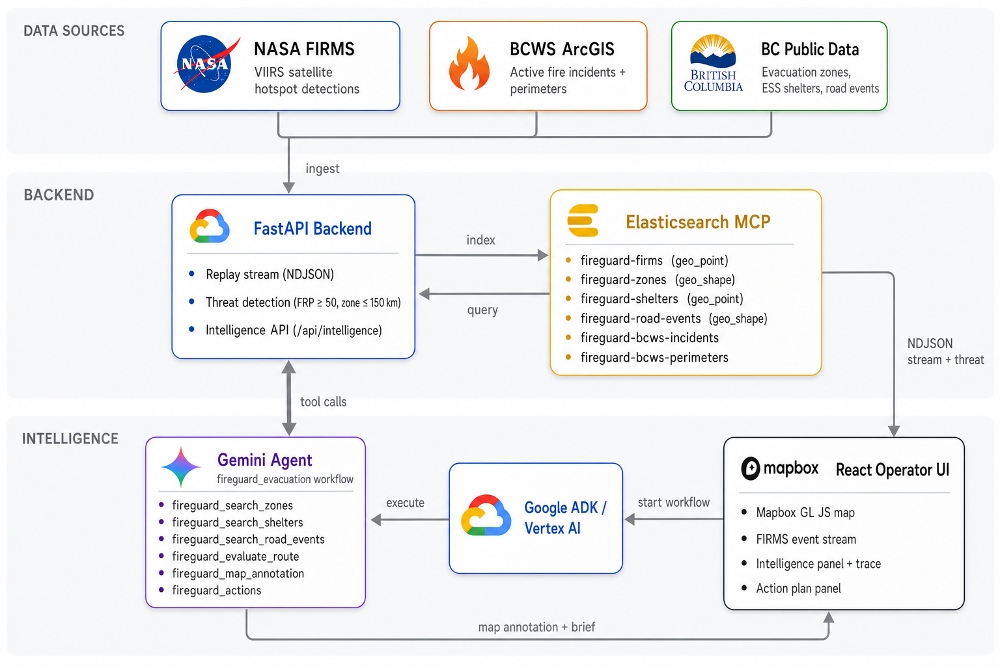
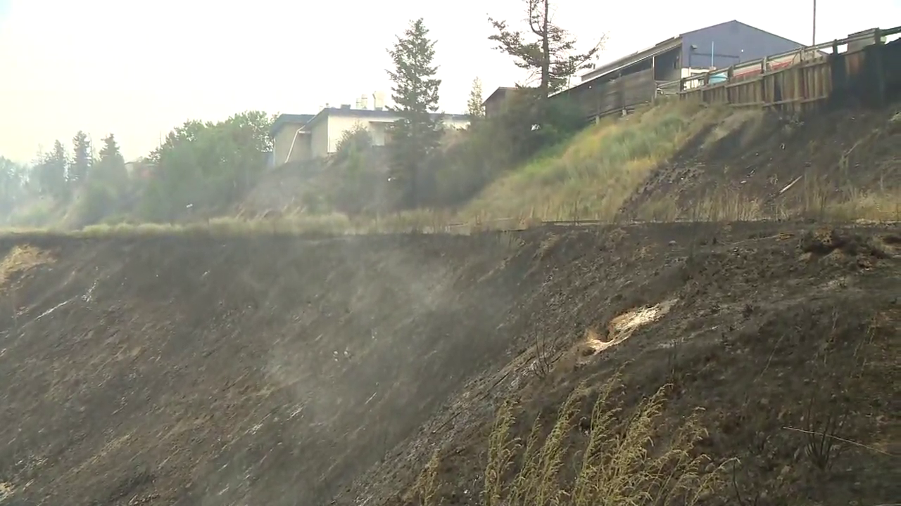
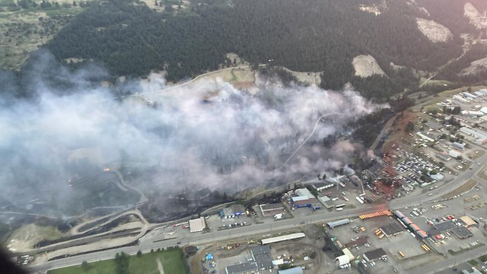
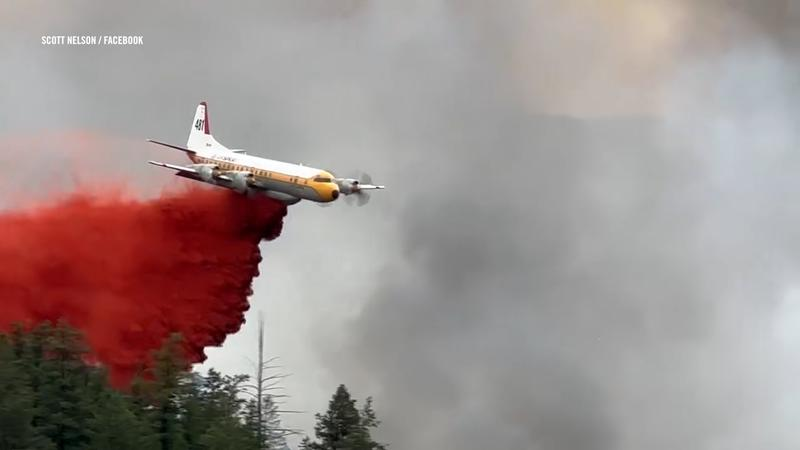
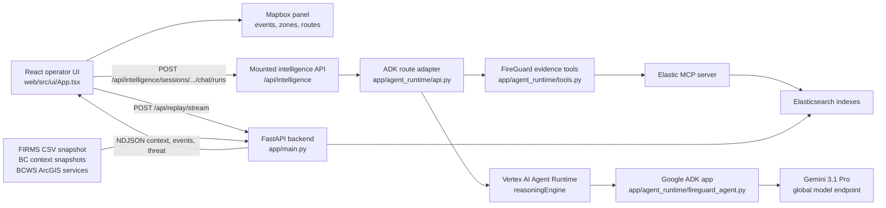
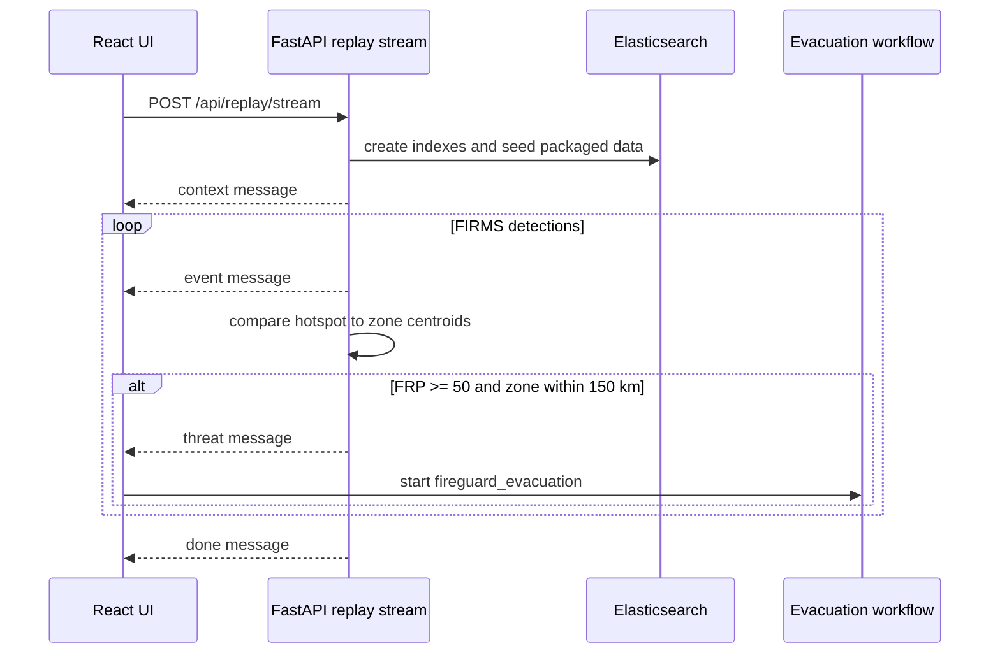
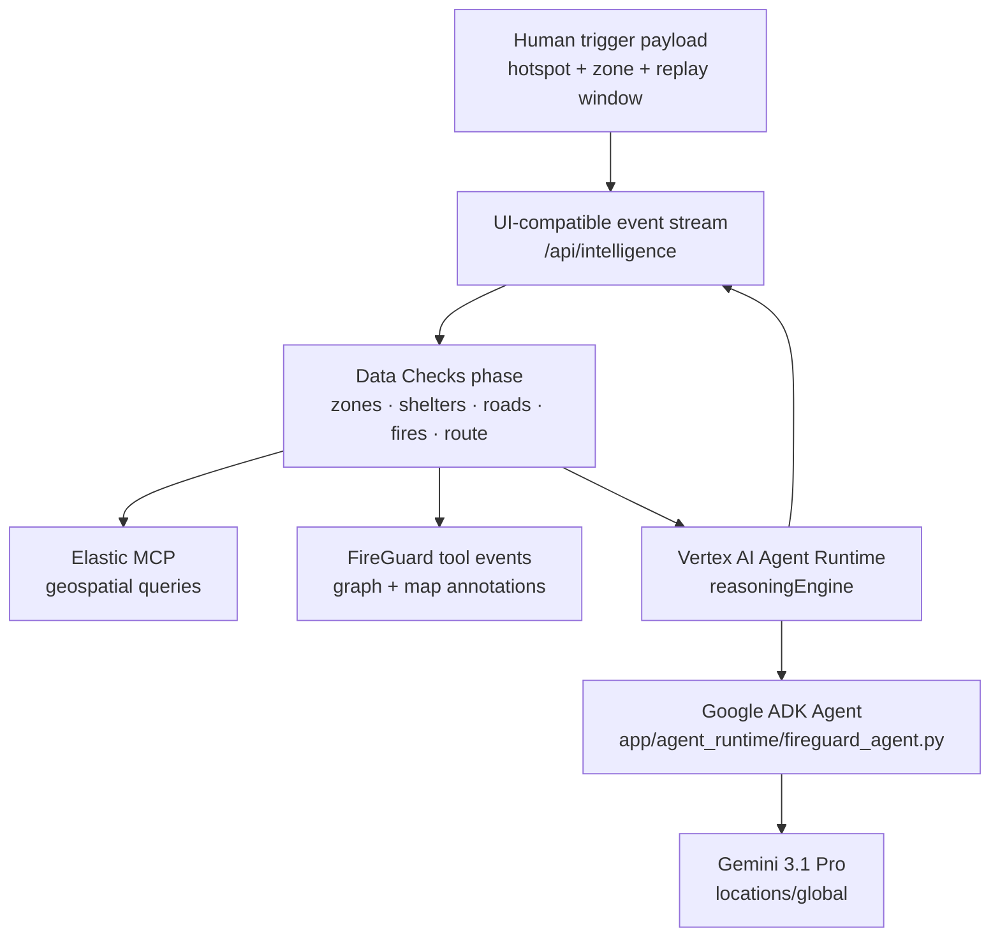

# FireGuard Whitepaper

<div align="center">

**Satellite-triggered wildfire evacuation coordination for the Google Cloud Rapid Agent Hackathon**

<p>
  
  &nbsp;&nbsp;
  
  &nbsp;&nbsp;
  
  &nbsp;&nbsp;
  
  &nbsp;&nbsp;
  
  &nbsp;&nbsp;
  
  &nbsp;&nbsp;
  
</p>


</div>

---

## Table of Contents

- [The Problem](#the-problem)
- [What FireGuard Does](#what-fireguard-does)
- [The Incident](#the-incident)
- [Scenario](#scenario)
- [Quick Start](#quick-start)
- [System Design](#system-design)
  - [Runtime Architecture](#runtime-architecture)
  - [Replay and Trigger Loop](#replay-and-trigger-loop)
  - [Evacuation Workflow](#evacuation-workflow)
  - [Indexed Data](#indexed-data)
- [Threat Scoring Methodology](#threat-scoring-methodology)
- [Design Notes](#design-notes)
  - [Stable Event Contracts](#stable-event-contracts)
  - [Agent Tooling](#agent-tooling)
  - [Map Annotations](#map-annotations)
  - [Route What-Ifs](#route-what-ifs)
- [Tech Stack](#tech-stack)
- [Project Structure](#project-structure)
- [Verification](#verification)



---

## The Problem

Every summer, BC incident commanders face the same cascade of questions. They have minutes, with lives at stake.

A wildfire ignites near a populated area. The fire is moving fast. The commander needs to know: **Which evacuation zones are in range? How many people? Which shelters are open right now? Which roads are safe to use? How long do we have?**

In 2024, BC recorded **51 evacuation orders** covering more than **4,100 properties**, and **112 evacuation alerts** covering more than **12,500 properties**. Wildfire suppression cost **$621 million**. On the worst days, over 330 fires were burning simultaneously across the province.

### The coordination gap

Today, assembling a situational picture during an active wildfire threat looks like this:

| Task | How it's done today |
|---|---|
| Identify affected evacuation zones | GIS analyst queries a separate provincial system |
| Check shelter availability | Phone calls to ESS facility coordinators |
| Find open evacuation routes | Check DriveBC manually, cross-reference road event feeds |
| Assess satellite detections | FIRMS data requires GIS expertise to interpret |
| Evaluate a specific route | Manual check against each known constraint |
| Update the map for field crews | Separate workflow, often on a different system |

Each of those steps takes time. Phone calls go unanswered. Systems are not integrated. Data is stale. A complete situational picture can take **20 to 45 minutes** to assemble, in an incident where the fire behaviour can change every 10.

In Williams Lake on July 21, 2024, the fire went from ignition to Rank 4 fire behaviour in under an hour. The mayor, a 50-year resident, said he had never seen growth that fast. Evacuation alerts were issued for 3,000 properties. The decisions had to be made immediately, with fragmented tools.

### Before FireGuard

```
Hotspot detected by satellite
        ↓
GIS analyst pulls FIRMS data  (~10 min)
        ↓
Coordinator identifies affected zones  (~10 min)
        ↓
Phone calls to ESS shelters  (~15 min, often incomplete)
        ↓
DriveBC manual road check  (~10 min)
        ↓
Verbal debrief to incident commander
        ↓
Commander makes decision  (40–45 min after detection)
        ↓
Map updated separately for field crews
```

### After FireGuard

```
Hotspot detected by satellite
        ↓
FireGuard receives threat event  (automatic, <1 sec)
        ↓
Gemini agent queries Elasticsearch MCP in parallel:
  zones · shelters · road events · route safety · fire context
        ↓
Structured brief + annotated map delivered  (<60 sec)
        ↓
Commander acts on a complete picture
```

The output gives a specific recommendation: which zone, which shelter, which route, and what caveats. If a road closes mid-incident, the what-if route evaluation reruns in seconds, not minutes.

---

## What FireGuard Does

FireGuard is an AI-assisted wildfire evacuation coordination app. It combines NASA FIRMS satellite detections, BC Wildfire Service context, evacuation zones, ESS facilities, road events, weather context, Elasticsearch geospatial queries, and a FireGuard agent workflow into one operator interface.

The workflow checks:

- affected evacuation zones
- nearby ESS shelter status
- active road events
- route safety from the zone centroid to open shelters
- nearby fire detections for intensity context
- map annotations for hotspots, zone centroids, shelters, blockages, and evaluated routes

The result is an evacuation brief plus visual map context. The app is a trigger-to-action workflow.


---

## The Incident

On **July 21, 2024 at 5:45 PM**, a tree fell onto a power line in the River Valley on the west side of Williams Lake, British Columbia. Within minutes the fire was burning at Rank 3 to 4 intensity. The mayor, a 50-year resident, said he had never seen fire grow that fast. Thick black smoke was visible from every corner of the city. Planes dropped red fire retardant at rooftop level.

By the end of that night, **440 properties were under evacuation order** and **3,000 more were on evacuation alert**. The City declared a State of Local Emergency. Across BC, 330 wildfires were burning simultaneously, with 977 firefighters and 178 aviation crews deployed province-wide.

By July 23 the River Valley fire was classified as *held*. Crews had stopped its spread. The evacuation alert was lifted. The city had narrowly avoided a catastrophe.

<table>
<tr>
<td width="58%">

</td>
<td width="40%" valign="top">

<br/><br/>

</td>
</tr>
</table>

**Coverage:**

- [Williams Lake residents warned to be ready to leave as wildfire nears city — CBC News, July 21](https://www.cbc.ca/news/canada/british-columbia/new-wildfire-erupts-in-williams-lake-1.7270867)
- [Drones and water access banned as wildfire burns in city — CBC News, July 22](https://www.cbc.ca/news/canada/british-columbia/williams-lake-evacuation-july-22-1.7271234)
- [City declares state of emergency, expands evacuation alert — CFJC Today, July 22](https://cfjctoday.com/2024/07/22/city-of-williams-lake-declares-local-state-of-emergency-expands-evacuation-alert-related-to-river-valley-wildfire/)
- [Close call: wildfire burns to edge of Williams Lake — Global News, July 22](https://globalnews.ca/news/10636715/wildfire-burns-edge-williams-lake/)
- [Wildfire being held, evacuation alert lifted — CBC News, July 23](https://www.cbc.ca/news/canada/british-columbia/williams-lake-wildfire-held-1.7273125)

FireGuard replays the FIRMS satellite detections from this event window (July 17 to 25, 2024) against the actual evacuation zones, ESS shelters, and road events that were active at the time.

---

## Scenario

The bundled replay window covers **July 17 to 25, 2024**, the week the River Valley fire ignited. The 45-row FIRMS CSV snapshot captures the satellite detections from that period. When `NASA_FIRMS_MAP_KEY` is set, the backend fetches the full FIRMS dataset live before replaying.

When a hotspot exceeds the FRP threshold and falls within 150 km of a seeded evacuation zone centroid, the backend emits a `threat` event and the UI opens the `fireguard_evacuation` workflow automatically.

To walk the full flow:

1. Start the replay from the web UI.
2. Watch FIRMS detections stream onto the map and event feed.
3. When the threat arrives, the `fireguard_evacuation` workflow opens automatically.
4. Inspect the tool trace: zones, shelters, roads, routes, fire context, map annotation, completion payload.
5. Ask a route what-if question and inspect the route reevaluation.

---

## Quick Start

```bash
python3 -m venv .venv
. .venv/bin/activate
pip install -r requirements.txt

cd web
npm install
cd ..

cp .env.example .env
./start.sh
```

`./start.sh` launches:

| Service | URL |
|---|---|
| FastAPI backend | `http://127.0.0.1:8100` |
| Vite frontend | `http://127.0.0.1:5174` |

Configure `.env` from `.env.example` for Elasticsearch, Mapbox, NASA FIRMS, and Vertex AI.

---

## System Design

### Runtime Architecture




### Replay and Trigger Loop



### ADK Agent Flow




The running intelligence path is Google ADK on Vertex AI Agent Runtime. The FastAPI route under `/api/intelligence` keeps the frontend contract stable for sessions, runs, graph events, and chat history. For replay threats, the route first performs the FireGuard evidence phase through Elastic MCP: evacuation zones, shelters, road events, FIRMS detections, BCWS context, route evaluation, map annotation, and action plan. It then sends the compact evidence package to Agent Runtime so Gemini 3.1 Pro writes the final incident brief.

Current deployed resource:

```text
projects/127704576091/locations/us-central1/reasoningEngines/3357933250239528960
```

The Agent Runtime resource runs in `us-central1`. The Gemini model call is pinned to `gemini-3.1-pro-preview` with `GOOGLE_CLOUD_LOCATION=global`.

### Indexed Data

| Index suffix | Contents | Source in repo |
|---|---|---|
| `firms` | FIRMS hotspot detections and weather/place enrichment fields | `data/replay/bc_cariboo/firms_snapshot.csv` |
| `firms-cache` | FIRMS fetch cache metadata | `app/main.py` |
| `bcws-incidents` | BCWS active fire incidents | BCWS ArcGIS query path in `app/main.py` |
| `bcws-perimeters` | BCWS perimeter shapes | BCWS ArcGIS query path in `app/main.py` |
| `bcws-cache` | BCWS area cache metadata | `app/main.py` |
| `zones` | Evacuation zone centroids and polygons | `data/public/bc/historical_fire_evacuation_zones_snapshot.json` |
| `shelters` | ESS facility status and location | `data/public/bc/public_emergency_context_snapshot.json` |
| `road-events` | Road event locations and shapes | `data/replay/bc_cariboo/road_events_snapshot.json` |

Packaged data currently includes 45 FIRMS rows, 3 evacuation zones, 10 ESS facilities, 8 evacuation order or alert records, 4 policy snippets, 1 road event, and 1 weather snapshot.

---

## Why Elasticsearch

The packaged dataset is deliberately small: 45 FIRMS rows, 3 evacuation zones, 10 shelters, 1 road event. That is enough to run the replay and trigger a workflow without any external API keys.

The live cluster for this event window tells a different story:

| Index | Documents | Size |
|---|---|---|
| `fireguard-firms` | **38,744** | 17.0 MB |
| `fireguard-bcws-incidents` | 633 | 284 KB |
| `fireguard-bcws-perimeters` | 182 | 3.9 MB |
| `fireguard-shelters` | 10 | 15 KB |
| `fireguard-zones` | 3 | 11 KB |
| `fireguard-road-events` | 1 | 11 KB |
| **Total** | **39,599** | **20.8 MB** |

38,744 FIRMS detections for the Williams Lake / Cariboo region, each enriched with Open-Meteo weather (wind speed, wind direction, gusts, temperature, humidity, precipitation) and Google Maps reverse geocoding (formatted address, place type). 182 BCWS fire perimeter polygons as `geo_shape` documents. 633 active incident records.

That is the dataset the agent queries live during a workflow run. Every `fireguard_search_zones` call, every `fireguard_evaluate_route`, and every shelter lookup runs against this index as the workflow executes.

Three things pushed the data layer toward Elasticsearch specifically:

The agent needs to find zones near a hotspot, shelters near a zone centroid, and road events near a route corridor, all at different radii, all on different indexes, all within the same workflow run. `geo_distance` and `_geo_distance` sort on a `geo_point` field handle this exactly, without any application-layer geometry math beyond the haversine check on the returned hits.

Fire perimeters are Polygon and MultiPolygon shapes covering thousands of hectares. Querying which perimeters overlap a given search area requires `geo_shape` with `relation: intersects`. There is no equivalent in a document store that only indexes points.

`fireguard_evaluate_route` interpolates a straight-line route into segments, computes a corridor, and runs a `geo_distance` query to pull all fire detections and road closures near that corridor in one round trip. Pulling all records and filtering in Python does not scale once the FIRMS index holds thousands of detections per season.

The MCP boundary keeps this clean: the agent never touches Elasticsearch directly. It calls a tool, the tool constructs the query body, the Elastic MCP server executes it, and the agent gets structured results it can reason over. The query is auditable in the tool trace. The agent cannot construct arbitrary queries. It can only call the tools FireGuard exposes.

## Elasticsearch MCP Integration

Elasticsearch is the evidence layer the agent reasons over. Every decision the Gemini agent makes during an evacuation workflow is grounded in an Elasticsearch query executed through the Elastic MCP server.

### How the MCP server connects

The Elastic MCP server runs as a Docker stdio container launched at agent startup:

```bash
docker run -i --rm \
  --add-host=host.docker.internal:host-gateway \
  -e ES_URL -e ES_API_KEY \
  docker.elastic.co/mcp/elasticsearch stdio
```

The agent calls the MCP `search` tool with an index name and a full Elasticsearch query body. The MCP server executes the query against the configured cluster and returns the raw hits. FireGuard's tool layer parses the response and hands structured results back to the agent. This means the agent never touches Elasticsearch directly. All queries go through the MCP boundary, which keeps the tool interface clean and auditable in the trace panel.

### What each tool actually queries

| Tool | Index | Query type | What it finds |
|---|---|---|---|
| `fireguard_search_zones` | `fireguard-zones` | `geo_distance` + `_geo_distance` sort | Evacuation zones within 150 km of the hotspot, sorted by distance. Returns population, homes, and centroid coordinates. |
| `fireguard_search_shelters` | `fireguard-shelters` | `geo_distance` + optional `term` on `status` | ESS facilities within 400 km of the zone centroid. The 400 km radius is intentional: the only open shelter during the Williams Lake event was 280 km south in Merritt. |
| `fireguard_search_road_events` | `fireguard-road-events` | `geo_distance` + text matching on event type | Road closures and restrictions near the evacuation corridor. Closure detection uses keyword matching against `event_type`, `severity`, `title`, and `description` fields. |
| `fireguard_evaluate_route` | `fireguard-firms` + `fireguard-road-events` | `geo_distance` on interpolated polyline corridor | Checks a straight-line route against both active fire detections (5 km buffer) and road closures (2 km buffer). Returns `safe: true/false` with specific risk flags and evidence. |
| `fireguard_search_events` | `fireguard-firms` | `geo_distance` + `range` on `acquired_at` | FIRMS hotspot detections near the fire, filtered by date window. Returns FRP, confidence, source satellite, and weather enrichment. |
| `fireguard_bcws_context` | `fireguard-bcws-incidents` + `fireguard-bcws-perimeters` | `geo_bounding_box` + `geo_shape` intersects | BCWS active incidents and fire perimeter polygons intersecting the search area. The perimeter query uses a `geo_shape` envelope with `relation: intersects`, the only full polygon intersection query in the workflow. |
| `fireguard_stats` | `fireguard-firms` + incidents + perimeters | `min`/`max` aggregations + `terms` aggregation on `source` | Index counts, date span, and source breakdown for the sidebar stats panel. |

### Route evaluation in detail

`fireguard_evaluate_route` is the most complex query in the system. It interpolates the origin-to-destination route into 4 segments, computes a corridor around the midpoint, and runs two parallel Elasticsearch queries:

1. A `geo_distance` query on `fireguard-firms` fetching up to 200 fire detections near the corridor, sorted by distance from the route midpoint. Each hit is tested with `min_distance_to_polyline_km`. If any fire falls within 5 km of the route polyline, the route is flagged unsafe.

2. A `geo_distance` query on `fireguard-road-events` fetching up to 100 road events near the corridor. Each closure is tested against the same polyline. Closures within 2 km mark the route blocked.

The tool also accepts `hypothetical_closures`: a list of lat/lon points with labels that are injected as synthetic road constraints. This is how the what-if questions work: the operator types "what if Highway 97 closes" and the agent calls `fireguard_evaluate_route` with the closure coordinates, getting a new safe/blocked determination without touching the index.

### Geo field types and why they matter

Three indexes use `geo_shape` rather than `geo_point`:

- **`fireguard-bcws-perimeters`**: fire perimeter polygons. Queried with an envelope shape and `relation: intersects` to find all perimeters overlapping a bounding box.
- **`fireguard-zones`**: evacuation zone boundaries as Polygon or MultiPolygon GeoJSON. The centroid is stored separately as a `geo_point` for fast distance queries; the full shape is available for containment checks.
- **`fireguard-road-events`**: road closure extents as LineString or MultiLineString. The representative point is a `geo_point` for distance filtering; the geometry captures the full closure extent.

Using `geo_shape` for perimeters and zone boundaries means FireGuard can answer spatial questions that `geo_point` cannot, like whether a fire perimeter overlaps a given search area, or whether a road closure geometry intersects an evacuation corridor.

### Data ingestion and enrichment

Each FIRMS hotspot record is enriched before indexing:

- **Weather**: wind speed, wind direction, temperature, humidity, and precipitation from Open-Meteo archive API, cached by rounded coordinate and hour.
- **Place**: formatted address and place type from Google Maps reverse geocoding, cached by coordinate at 2 decimal places.

The enriched records are indexed into `fireguard-firms` with stable field shapes declared in the mapping before any documents are inserted. Elasticsearch rejects later schema-incompatible inserts, so the mapping is the contract. It is defined once in `app/main.py` and never changed at runtime.

BCWS incidents and perimeters are fetched live from the BC Wildfire Service ArcGIS feature servers on replay start, cached for 1 hour, and indexed into `fireguard-bcws-incidents` and `fireguard-bcws-perimeters`.

---

## Threat Scoring Methodology

FireGuard computes a live **threat score** (0 to 100) for every NASA FIRMS satellite detection during replay. The scoring model is grounded in peer-reviewed remote sensing literature and uses the same two physical variables that drive the binary threat alert.

### Why Fire Radiative Power?

Fire Radiative Power (FRP, in megawatts per pixel) is the instantaneous rate of radiative energy released by combustion. It is the primary intensity metric in the NASA FIRMS product family (MODIS MOD14/MYD14 and VIIRS VNP14) because it correlates directly with mass of fuel consumed, combustion completeness, and smoke emission rate.

> "FRP provides an instantaneous measure of the fire's rate of energy release, making it a physically meaningful and sensor-agnostic indicator of fire intensity."
> *Wooster et al. (2005), "Retrieval and analysis of combustion parameters from the Fire Radiative Energy measurements"*

#### Detection floor — 50 MW

MODIS Collection 6 has a theoretical minimum detectable FRP of roughly 56 MW per pixel under daytime conditions; the VIIRS 750 m product reaches ~13 MW. However, the widely-used SEVIRI geostationary product, which provides the operational benchmark for live fire monitoring in Europe and Africa, struggles to detect fires below 50 MW and systematically underestimates regional totals by 40 to 50% for low-intensity fires in that range (Roberts & Wooster 2008; Kumar et al. 2011). The 50 MW gate therefore represents the practical lower boundary below which satellite detections become too unreliable to drive automated alerts.

#### Scale ceiling — 300 MW

Ichoku et al. (2008) documented the full global MODIS FRP distribution as 0.02 to 1,866 MW per pixel. In the Canadian boreal forest context, extreme crown fires can push a single VIIRS pixel to several hundred megawatts, but the 300 MW value represents a practical saturation point above which the marginal threat increase per additional MW is small. The fire is already generating enough heat to spread into any adjacent fuel regardless of exact intensity. Using 300 MW as a ceiling normalises the FRP contribution to the 0 to 1 range:

$$\text{FRP component} = \min\!\left(0.6,\ \frac{\text{FRP} - 50}{250} \times 0.6\right)$$

### Why proximity to evacuation zones?

Distance from a fire detection to the nearest populated evacuation zone centroid is the direct operational variable: it determines how quickly fire behaviour can threaten populated areas and how much time coordinators have to act. Ohi & Kim (2022) model evacuation host-community catchment areas using a 150 km planning radius, which matches the BC context where rural communities are spread across large distances and inter-city evacuation corridors can easily span 100 to 200 km.

The 150 km radius is also the engagement boundary used in `threat_for_event()`, the function that fires the binary threat alert. The score therefore uses the identical gate to ensure the score is exactly consistent with when an alert fires.

Proximity contribution decays linearly from 40 points at zero distance to 0 points at the boundary:

$$\text{Proximity component} = \left(1 - \frac{d_{\min}}{150}\right) \times 0.4$$

### Full scoring formula

Both components are only evaluated when the event passes the binary threat gate ($\text{FRP} \geq 50$ and $d_{\min} \leq 150\text{ km}$); events outside these bounds score zero.

$$S = \min\!\left(100,\ \underbrace{\frac{\text{FRP} - 50}{250} \times 60}_{\text{intensity (0–60)}} + \underbrace{\left(1 - \frac{d_{\min}}{150}\right) \times 40}_{\text{proximity (0–40)}}\right)$$

Where:
- $\text{FRP}$ — Fire Radiative Power in megawatts (NASA FIRMS pixel value)
- $d_{\min}$ — great-circle distance in kilometres to the nearest BC evacuation zone centroid (Haversine formula)

The **60/40 weight split** intentionally favours intensity over proximity. A very high-FRP fire further from a zone is operationally significant because spotting and wind-driven spread can close a 100 km gap in hours. A low-FRP smoulder adjacent to a zone, by contrast, is unlikely to trigger rapid spread without intensification.

### Score thresholds visualised

| Score range | Colour | Interpretation |
|---|---|---|
| 1–24 | 🟢 Green | Low concern — detection near boundary of engagement zone or low intensity |
| 25–49 | 🟡 Yellow | Moderate — notable FRP or moderate proximity, warrants monitoring |
| 50–74 | 🟠 Orange | High — significant intensity and/or within ~75 km of zone |
| 75–100 | 🔴 Red | Critical — high-intensity fire within close proximity to populated zone |

Scores are emitted as `threat_score` on every `event` NDJSON message from the replay stream and rendered as scatter labels on the Mapbox map, coloured by threshold band.

### References

- Wooster, M.J., Roberts, G., Perry, G.L.W., & Kaufman, Y.J. (2005). Retrieval and analysis of combustion parameters from the Fire Radiative Energy measurements: FRP derivation and lava eruption. *Journal of Geophysical Research: Atmospheres*, 110(D24).
- Roberts, G., & Wooster, M.J. (2008). Fire detection and fire characterization over Africa using Meteosat SEVIRI. *IEEE Transactions on Geoscience and Remote Sensing*, 46(4), 1200–1218.
- Kumar, S.S., Roy, D.P., Boschetti, L., & Kremens, R. (2011). Exploiting the power law distribution properties of satellite fire radiative power retrievals. *Journal of Geophysical Research: Atmospheres*, 116(D19).
- Ichoku, C., Giglio, L., Wooster, M.J., & Remer, L.A. (2008). Global characterization of biomass-burning patterns using satellite measurements of fire radiative energy. *Remote Sensing of Environment*, 112(6), 2950–2962.
- NASA LP DAAC. MOD14A1 MODIS/Terra Thermal Anomalies/Fire Daily L3 Global 1 km SIN Grid V006. NASA EOSDIS Land Processes DAAC. https://doi.org/10.5067/MODIS/MOD14A1.006
- Ohi, J.M., & Kim, G. (2022). Wildfire evacuation host community planning: Estimating capacity from population and distance. *International Journal of Disaster Risk Reduction*, 71, 102791.

---

## Design Notes

### Stable Event Contracts

Elasticsearch mappings are declared in `app/main.py` before documents are inserted. The FireGuard event payload keeps fixed shapes for fields such as `location`, `weather`, `place`, `geometry`, and route output so later inserts do not collide with prior dynamic mappings.

The threat payload is narrow by design:

```json
{
  "type": "threat",
  "hotspot": {
    "lat": 52.1,
    "lon": -121.9,
    "frp": 50.0,
    "confidence": "nominal",
    "source": "VIIRS_NOAA20_SP",
    "acquired_at": "2024-07-21T18:00:00+00:00"
  },
  "zone": {
    "name": "Williams Lake River Valley",
    "population": 1548,
    "homes": 618,
    "latitude": 52.1,
    "longitude": -122.1,
    "distance_km": 12.34
  }
}
```

### Agent Tooling

The evacuation agent gets a constrained tool surface so it can move from detection to decision without broad exploration.

| Tool | Purpose |
|---|---|
| `fireguard_stats` | Count indexed FIRMS and BCWS records |
| `fireguard_search_events` | Search FIRMS detections by location, radius, and time |
| `fireguard_search_zones` | Find evacuation zones near a point |
| `fireguard_search_shelters` | Find ESS facilities near a zone centroid |
| `fireguard_search_road_events` | Find road events near the evacuation area |
| `fireguard_evaluate_route` | Check an origin-to-destination route against indexed fire and road constraints |
| `fireguard_bcws_context` | Retrieve BCWS incident and perimeter context |
| `fireguard_map_annotation` | Push markers and routes into the UI map |
| `fireguard_actions` | Push a structured incident action plan into the UI |

### Map Annotations

`fireguard_map_annotation` returns a compact annotation object with `markers`, `routes`, and a short `message`. The React intelligence panel passes that object back to the map through `onAnnotation`, allowing the analysis to draw the same shelters, blockages, and recommended route that the brief describes.

### Route What-Ifs

`fireguard_evaluate_route` accepts normal route endpoints and can also evaluate operator constraints through `hypothetical_closures` or `ignore_closures`. That lets the agent answer questions such as how the evacuation action changes if a corridor closes or reopens during an incident.

---

## Tech Stack

| Layer | Technology |
|---|---|
| Backend | FastAPI, Pydantic, uvicorn |
| Agent runtime | Google ADK on Vertex AI Agent Runtime |
| Data store | Elastic MCP over Elasticsearch with `geo_point` and `geo_shape` mappings |
| Source data | NASA FIRMS, BCWS ArcGIS services, packaged BC public context snapshots |
| Frontend | React 18, Vite, TypeScript |
| Mapping | Mapbox GL JS |
| Intelligence UI | React Markdown, Blueprint, Monaco, XYFlow |
| Testing | pytest, TypeScript build |

---

## Project Structure

```text
fireguard/
├── app/
│   ├── main.py                 # FastAPI app, replay stream, index creation, threat trigger
│   ├── geo.py                  # Geospatial helpers
│   └── agent_runtime/
│       ├── api.py              # Mounted intelligence API backed by Agent Runtime
│       ├── fireguard_agent.py  # Google ADK agent definition
│       ├── tools.py            # FireGuard Elastic MCP tools
│       └── tool_models.py      # Tool payload contracts
├── data/
│   ├── public/bc/              # Evacuation, ESS, and policy snapshots
│   └── replay/bc_cariboo/      # FIRMS, road, and weather snapshots
├── docs/assets/                # Logos and README illustrations
├── web/
│   ├── src/ui/                 # Replay map interface
│   └── src/intelligence/       # Workflow panel, graph, chat, tool feed
├── tests/                      # API and data contract tests
├── start.sh                    # Backend and frontend launcher
└── .env.example                # Runtime keys and configuration values
```

---

## Verification

Run backend tests:

```bash
pytest
```

Build the frontend:

```bash
cd web
npm run build
```

For a local smoke check, run `./start.sh`, open `http://127.0.0.1:5174`, send a FireGuard message, and confirm that the intelligence panel shows an ADK Agent run with Agent Runtime tool events.
