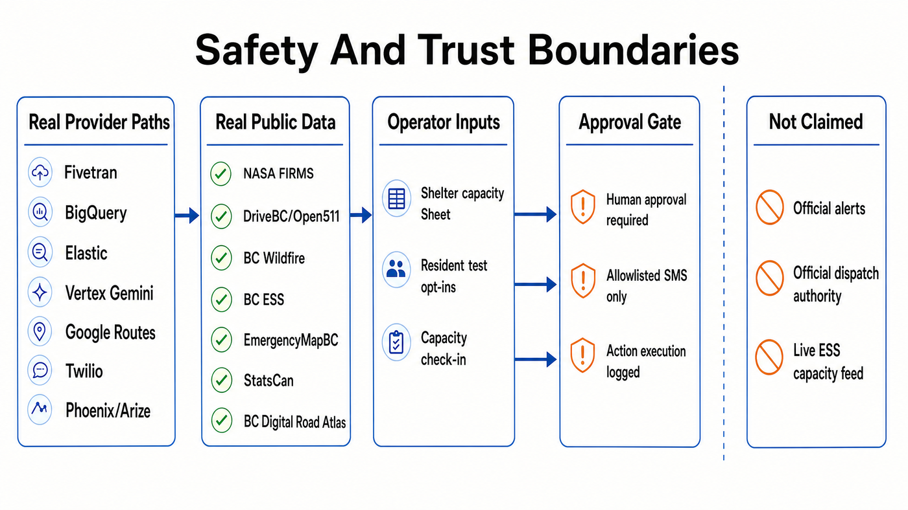
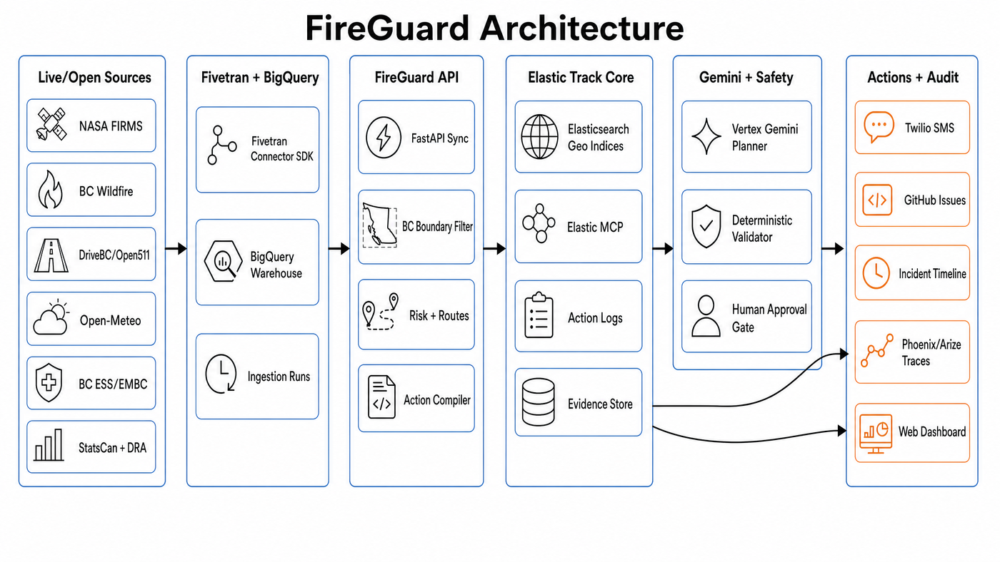
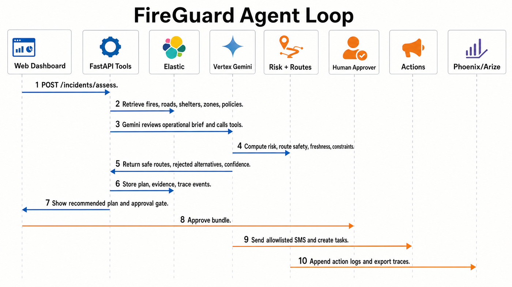
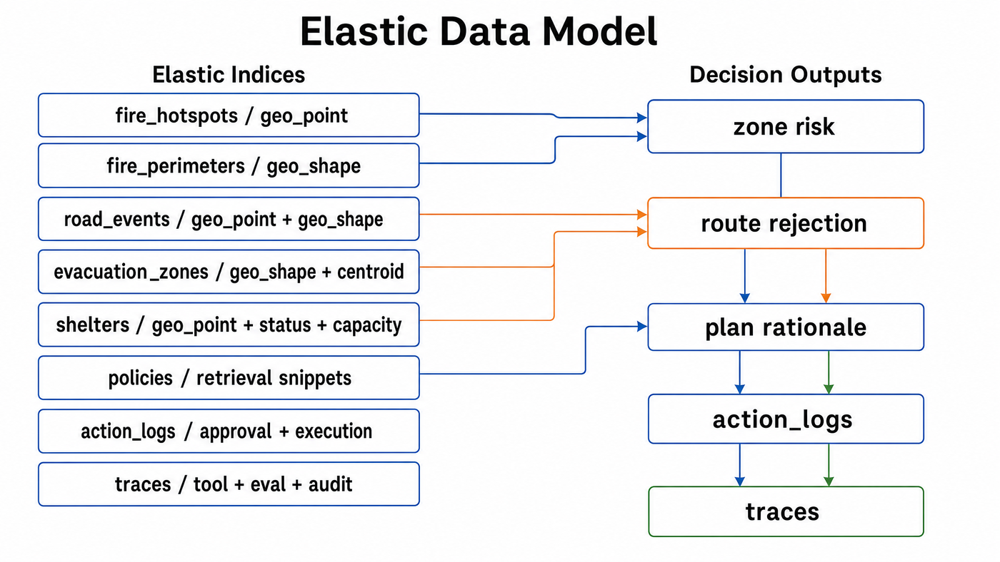
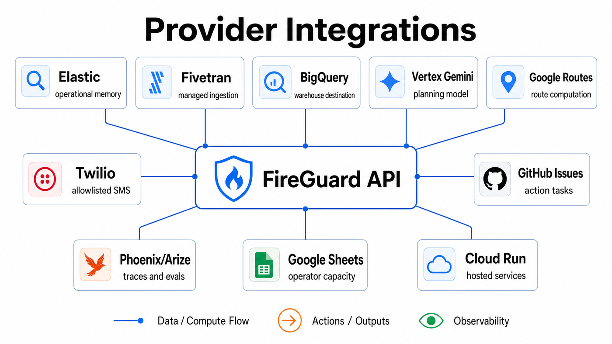
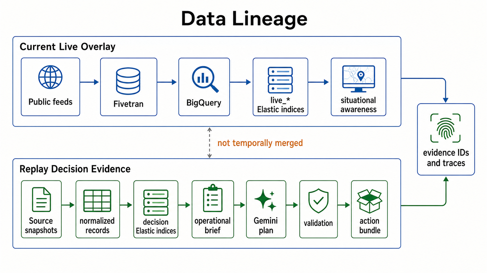
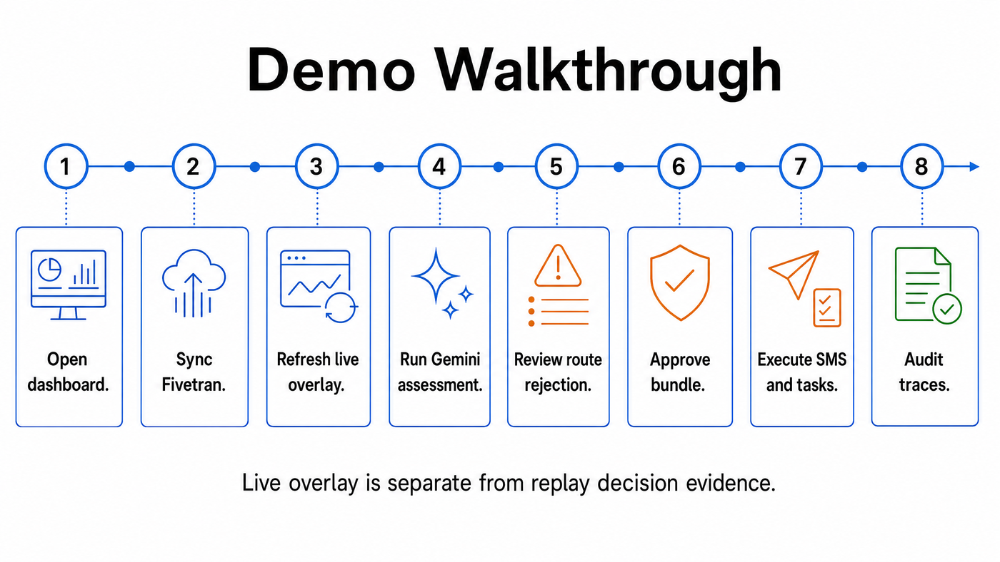
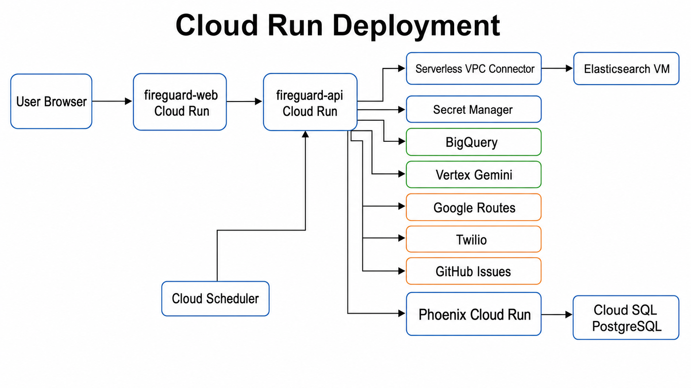

# FireGuard

<p align="center">
  
</p>

FireGuard is an AI evacuation coordinator that turns wildfire, road, weather, shelter, and population-zone data into staged, human-approved evacuation actions.

Elastic is the operational memory and geospatial retrieval layer. Fivetran handles production-style ingestion into BigQuery, and Phoenix/Arize capture trace and evaluation evidence.

Operational loop:

```text
real/open data -> Fivetran -> BigQuery -> Elastic -> Gemini tools -> approval -> SMS/tasks -> Phoenix/Arize audit
```

For the staged evacuation demo, FireGuard now runs in **hybrid mode**: replay source snapshots drive the reproducible evacuation decision, while a separately indexed current live overlay reads Fivetran-loaded BigQuery records for fresh FIRMS, BC Wildfire, DriveBC/Open511, and Open-Meteo context without pretending those records occurred in the same incident window.

The application retrieves operational context, evaluates conflicting constraints, drafts a staged plan, blocks public actions until human approval, executes test-channel actions, and records the evidence trail.

## Hosted Services

- Web app: https://fireguard-web-dovhkdlznq-uc.a.run.app
- API docs: https://fireguard-api-dovhkdlznq-uc.a.run.app/docs
- Repository: https://github.com/youneslaaroussi/fireguard
- Transparency ledger: [docs/transparency_ledger.md](docs/transparency_ledger.md)
- Walkthrough script: [docs/demo_script.md](docs/demo_script.md)
- Demo presentation: [docs/presentation/fireguard-demo-deck.pptx](docs/presentation/fireguard-demo-deck.pptx)

## Safety Notice

FireGuard does **not** issue official emergency alerts and must not be used for real emergency response. Public-facing actions require explicit approval, SMS delivery is restricted to allowlisted test contacts, and action tasks are sent to test channels such as GitHub Issues unless an official agency integration is configured.



Data and actions are labeled by source:

- **real/live provider paths**: Fivetran, BigQuery, Elastic, Gemini, Google Routes, Twilio, Phoenix/Arize;
- **real public source data**: NASA FIRMS, DriveBC/Open511, BC Wildfire, BC ESS facilities, EmergencyMapBC, Statistics Canada, BC Digital Road Atlas;
- **operator-provided inputs**: shelter capacity Sheet values and test resident opt-ins;
- **replay mode**: stored real source snapshots for deterministic runs;
- **simulated municipal endpoints**: unavailable official systems.

For the detailed status ledger, read [docs/transparency_ledger.md](docs/transparency_ledger.md).

## Why It Matters

During wildfires, emergency teams do not lack data. They have fire detections, road events, shelter status, weather, public guidance, and local zone context. The operational gap is that these signals live in separate systems while decisions are time-sensitive.

FireGuard closes that gap by converting fragmented signals into a coordinated plan:

- which zones need action;
- which routes are unsafe or unavailable;
- which shelters can accept people;
- which public messages and operational tasks should be prepared;
- which actions require approval before execution;
- which evidence justified the decision.

## Provider Status

| Area | Current implementation |
|---|---|
| Hosted app | Cloud Run web and API services are deployed and publicly reachable. |
| Elastic | Elasticsearch runs on GCE; Cloud Run reaches it through a VPC connector; hosted status reports `elastic-mirrored`. |
| Elastic MCP | Official Elastic MCP server has been verified against the same Elasticsearch deployment. |
| Fivetran | Managed Connector SDK connection syncs source records into BigQuery. |
| BigQuery bridge | Backend replaces Elastic streams from Fivetran-loaded warehouse tables. |
| Live overlay | Fivetran BigQuery rows populate separate `live_*` Elastic indices for situational awareness; direct source adapters are explicit fallback only. These records are visible but not decision-eligible for replay plans. |
| Gemini | Hosted backend uses Vertex Gemini `gemini-3.1-flash-lite-preview` in `global`; ADK/Agent Engine package is included. |
| Routes | Google Routes is used when configured, with deterministic fallback for local tests. |
| Twilio | Outbound SMS works only for allowlisted test recipients; inbound opt-in webhook stores consent metadata. |
| Action tasks | Approved shelter, road-ops, and dispatch actions can create real GitHub Issues. |
| Observability | OpenTelemetry spans export to self-hosted Phoenix and duplicate Arize AX OTLP when configured. |
| Evals | Deterministic eval checks run after assessment and are exported as trace spans. |

Current live BC FIRMS data may not threaten the configured zones. In that case FireGuard returns a **monitor-only** internal update and creates no public actions. Route-rejection workflows use labeled replay evidence unless live conditions genuinely match the scenario; hybrid mode keeps current live overlay records separate from that replay decision context.

## Architecture



Key paths:

- Fivetran syncs public wildfire, road, perimeter, and weather feeds into BigQuery.
- The backend normalizes, filters to BC, and indexes geospatial records into Elastic.
- Gemini chooses the operational plan from safe route, shelter, risk, freshness, and action primitives.
- Deterministic services validate safety, evidence, approval, shelter status, route safety, and SMS allowlists.
- Approved actions execute through Twilio, GitHub Issues, and timeline records, with Phoenix/Arize traces.

## Agent Loop



The agent loop is intentionally split between Gemini and deterministic services: Gemini composes the operational strategy, while backend tools enforce route safety, evidence, approval, freshness, and action execution rules.

## Elastic Data Model



Elastic stores both operational evidence and audit records. Geospatial indices drive risk and route decisions; action and trace indices preserve the approval and execution history.

## Provider Integrations



### Elastic

Elastic is the official track integration and the core operational memory:

- geospatial indexing for fires, perimeters, road events, shelters, and zones;
- evidence retrieval for incident context and policy snippets;
- action logs, traces, and eval records;
- Elastic MCP server pointed at the same deployment for partner validation.

### Fivetran

Fivetran is the ingestion layer:

- `integrations/fivetran/fireguard_connector` emits `fire_hotspots`, `fire_perimeters`, `road_events`, `weather_observations`, and `ingestion_runs`;
- BigQuery is the warehouse destination;
- `POST /sync/fivetran-to-elastic` replaces Elastic streams from Fivetran-loaded tables;
- NASA FIRMS rows from the rectangular BC bbox are filtered through the official Province of BC boundary before indexing.

### Gemini / Google Cloud

The backend uses Vertex Gemini for tool-grounded assessment, with deterministic backend services enforcing safety math and action rules. The ADK package lives in [integrations/google_adk](integrations/google_adk) and exposes the same OpenAPI tool contract used by the hosted API.

### Arize Phoenix

The API exports OpenTelemetry spans to Phoenix and duplicate spans to Arize AX when configured. The in-app audit panel shows trace IDs, tool calls, rejected alternatives, approval state, action results, and eval checks.

### Twilio And GitHub Issues

Twilio executes real messages, but only to allowlisted test contacts. GitHub Issues creates concrete operational task records for shelter, road-ops, and dispatch channels. These are test action channels, not official municipal systems.

## Data Sources



Live/open source paths:

- NASA FIRMS active fire detections;
- BC Wildfire current fire perimeters;
- DriveBC/Open511 road events;
- Open-Meteo wind forecasts;
- Google Routes API;
- EmergencyMapBC evacuation orders and alerts;
- BC Emergency Social Services facilities;
- Statistics Canada 2021 Census Profile;
- BC Digital Road Atlas.

Source-backed replay paths:

- recorded NASA FIRMS snapshot;
- recorded road-event/perimeter/weather snapshots;
- BC historical evacuation-zone snapshots with provenance.

Operator/test paths:

- shelter capacity from operator Sheet or manual check-in;
- Twilio inbound resident test opt-in;
- GitHub Issues action tasks;
- simulated municipal webhooks when GitHub task backend is not configured.

## Walkthrough



1. Open the hosted dashboard.
2. Show provider strip: Fivetran, Elastic, Gemini, Phoenix/Arize.
3. Click `Sync Fivetran To Elastic`.
4. Click `Refresh Fivetran live overlay` to show the latest warehouse-backed live source records separately from replay decision evidence.
5. Click `Run Agent Assessment`.
6. In live-low-risk mode, show that FireGuard returns monitor-only and sends no public action.
7. Click `Reset Demo` to load the replay-ready staged evacuation scenario when current live data is low-risk.
8. Show route/shelter alternatives rejected with evidence.
9. Approve the action bundle.
10. Execute actions: Twilio SMS and GitHub Issues tasks.
11. Open audit view: source records, freshness, confidence, rejected options, evals, Phoenix/Arize trace IDs.

## Local Setup

Requirements:

- Node.js 20+
- npm 10+
- Python 3.12+
- `uv` or `pip`

```bash
cd /Users/mac/dev/fireguard
cp .env.example .env

cd apps/api
python3 -m venv .venv
. .venv/bin/activate
pip install -e ".[bigquery,dev]"

cd ../web
npm install
```

Run the API and web app in separate terminals:

```bash
cd /Users/mac/dev/fireguard
npm run dev:api
```

```bash
cd /Users/mac/dev/fireguard
npm run dev:web
```

Open:

- API: http://localhost:8000/docs
- Web: http://localhost:3000

Local mode runs with replay/memory fallbacks when provider credentials are absent. Full provider mode requires the environment variables below.

## Environment Variables

See [.env.example](.env.example). Important variables for full provider mode:

- `ELASTICSEARCH_URL`, `ELASTICSEARCH_API_KEY`, optional `ELASTICSEARCH_CLOUD_ID`
- `FIVETRAN_API_KEY`, `FIVETRAN_API_SECRET`, `FIVETRAN_CONNECTION_ID`
- `FIVETRAN_BIGQUERY_PROJECT`, `FIVETRAN_BIGQUERY_DATASET`
- `NASA_FIRMS_MAP_KEY`
- `GOOGLE_CLOUD_PROJECT`, `GOOGLE_CLOUD_LOCATION`, `GEMINI_MODEL`
- `GOOGLE_MAPS_API_KEY`
- `GOOGLE_SHEETS_CAPACITY_SPREADSHEET_ID`, `GOOGLE_SHEETS_CAPACITY_RANGE`
- `TWILIO_ACCOUNT_SID`, `TWILIO_AUTH_TOKEN`, `TWILIO_FROM_NUMBER`, `TWILIO_ALLOWLIST`
- `PHOENIX_COLLECTOR_ENDPOINT`, `PHOENIX_PROJECT_NAME`
- `ARIZE_SPACE_ID`, `ARIZE_API_KEY`, `ARIZE_COLLECTOR_ENDPOINT`
- `ACTION_TASK_BACKEND`, `GITHUB_REPO`, `GITHUB_TOKEN`

Do not commit `.env` or provider secrets.

## Fivetran Connector

```bash
cd integrations/fivetran/fireguard_connector
python3 -m venv .venv
. .venv/bin/activate
pip install "fivetran-connector-sdk==2.8.1" -r requirements.txt
cp configuration.json.example configuration.json
fivetran debug . --configuration configuration.json
```

After Fivetran syncs into BigQuery:

```bash
curl -X POST http://localhost:8000/sync/fivetran-to-elastic
```

Direct `/ingest/*` routes remain as replay/development fallback only.
`POST /sync/live-overlay` is a separate situational-awareness path that prefers Fivetran BigQuery output and writes current records into `live_*` Elastic indices. If Fivetran/BigQuery is unavailable, it can fall back to direct source adapters with `fallback_active=true`. It is not used to make the replay evacuation decision.

## Google ADK Agent

```bash
cd integrations/google_adk
python3 -m venv .venv
. .venv/bin/activate
pip install -r requirements.txt
cp fireguard_agent/.env.example fireguard_agent/.env
adk run fireguard_agent
```

The ADK agent loads `tools.openapi.json` and points at the same FastAPI tool endpoints used by the web application.

## Phoenix / Arize

For local Phoenix:

```bash
python3 -m pip install arize-phoenix
phoenix serve
```

The deployed Phoenix service uses Cloud SQL PostgreSQL for persistence. Eval runs create trace spans with deterministic checks; when the Phoenix annotation API returns an annotation ID, FireGuard records that ID in the eval response.

## Tests

```bash
cd apps/api
. .venv/bin/activate
pytest
```

Web type check:

```bash
npm --prefix apps/web run lint
```

Full root test command:

```bash
npm run test
```

The API test suite covers simple evacuation, route rejection, shelter overflow, unsafe evacuation, stale data, SMS allowlist enforcement, Fivetran sync/status, BC boundary filtering, live low-risk monitor behavior, and eval scoring.

## Hosted Verification Commands

```bash
curl https://fireguard-api-dovhkdlznq-uc.a.run.app/health
```

```bash
curl https://fireguard-api-dovhkdlznq-uc.a.run.app/integrations/status
```

```bash
curl -X POST https://fireguard-api-dovhkdlznq-uc.a.run.app/sync/fivetran-to-elastic
```

```bash
curl -X POST https://fireguard-api-dovhkdlznq-uc.a.run.app/incidents/assess
```

```bash
curl -X POST https://fireguard-api-dovhkdlznq-uc.a.run.app/evals/demo-incident-bc-001
```

Expected hosted health signal:

```json
{
  "status": "ok",
  "env": "production",
  "demo_mode": true,
  "store_backend": "elastic-mirrored"
}
```

## Cloud Run Deployment



The deployed API uses Cloud Run, Secret Manager, and a Serverless VPC connector to reach the Elasticsearch VM on its private address. The Elastic VM firewall must allow the connector CIDR on port 9200; the hosted deployment currently allows the `fireguard-connector` range `10.8.0.0/28` to the `fireguard-elastic` target tag.

```bash
gcloud builds submit . \
  --config infra/cloudrun/cloudbuild-api.yaml \
  --substitutions _IMAGE=us-central1-docker.pkg.dev/$GOOGLE_CLOUD_PROJECT/fireguard/fireguard-api:latest
```

```bash
gcloud builds submit . \
  --config infra/cloudrun/cloudbuild-web.yaml \
  --substitutions _IMAGE=us-central1-docker.pkg.dev/$GOOGLE_CLOUD_PROJECT/fireguard/fireguard-web:latest,_API_URL=https://YOUR_API_URL
```

Cloud Scheduler jobs are documented in [infra/cloudrun/scheduler.md](infra/cloudrun/scheduler.md).

## Repository Structure

```text
apps/
  api/        FastAPI backend, deterministic safety services, tool endpoints
  web/        Next.js dashboard
data/         replay snapshots, source-backed public datasets, synthetic test fixtures
docs/         architecture, data sources, transparency ledger, walkthrough script
infra/        Cloud Run, Cloud Build, Elastic MCP, scheduler notes
integrations/
  fivetran/   Connector SDK implementation
  google_adk/ ADK agent package and OpenAPI toolset
```

## License

This project is released under the MIT License. See [LICENSE](LICENSE).
